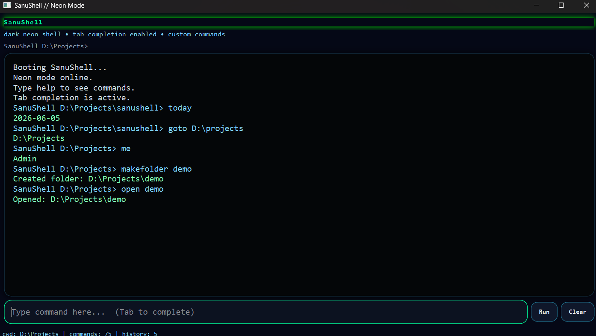
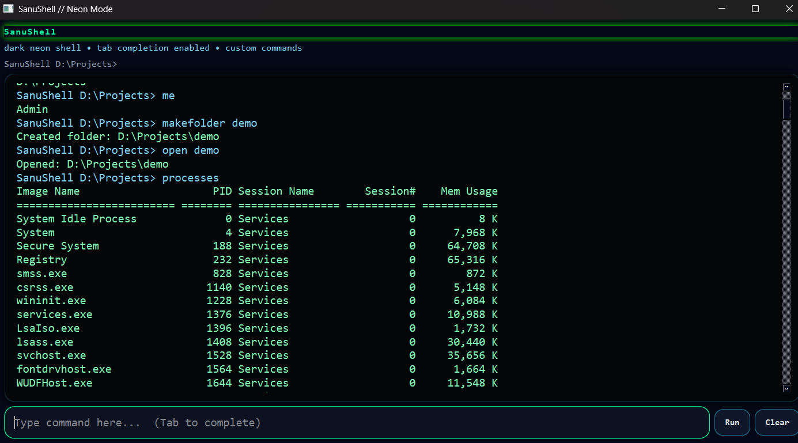
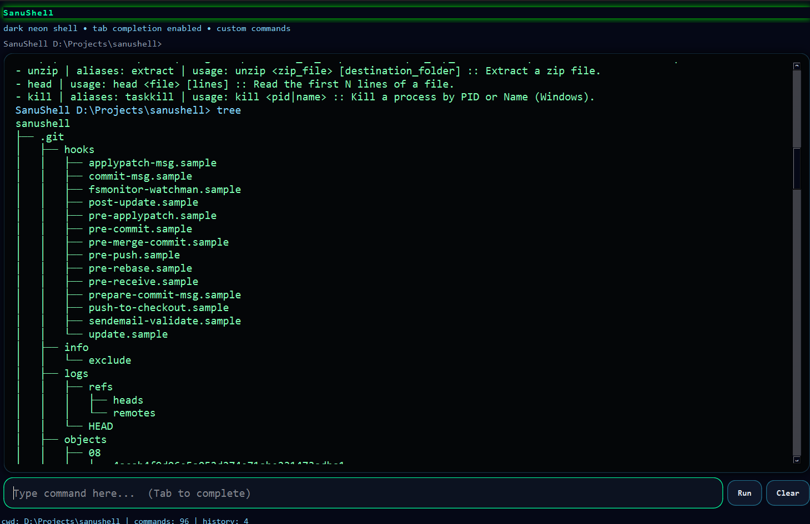

# SanuShell

SanuShell is a **custom Windows shell replacement** built in Python. It uses a **dark neon UI** made with **PySide6** and a safe, multi-threaded command engine that runs your own custom commands instead of forcing you to remember standard CMD-style commands.

It is designed to feel like a real shell, but with your own command language and a cyberpunk hacker aesthetic.

## Screenshots


*Boot sequence, dark neon UI, and directory navigation.*


*Viewing live Windows system processes directly inside the shell.*


*Executing Git directory tree views and exploring newly added commands.*

## What SanuShell does

SanuShell gives you:

* a custom terminal-style window
* your own command names such as `files`, `goto`, `zip`, `download`, `ip`, `processes`, and more
* Windows system access through safe command wrappers
* **Multi-threaded background execution** (UI never freezes during heavy tasks!)
* command history with Up/Down arrow support
* tab completion for command names
* live command suggestions
* a dark neon hacker-style theme
* a backend that can later support autocomplete, plugins, AI commands, and more

## Example command style

Instead of remembering traditional shell commands, you can type your own:

```text
files
where
goto C:\Users
makefolder demo
download https://example.com/file.zip
unzip file.zip
zip demo backup.zip
ip
processes
kill notepad.exe
calc 5 + 7 * 2
echo hello > note.txt
files | filter py | count
setvar PROJECT SanuShell
echo $PROJECT
alias ll files
ll
run python --version
exit
```

You can also combine commands:

```text
where ; files
makefolder logs && echo created
read missing.txt || echo fallback
files | filter py | sort | take 5
echo first line > notes.txt
echo second line >> notes.txt
```

## How it works
The project has two major parts:
1. **Command backend**  
   This is the brain of the shell. It reads your input, parses the command, finds the matching custom command in the registry, executes it via a background thread, and returns the output back to the UI.

2. **PySide6 UI**  
   This is the shell window. It shows the output console, accepts commands from the input box, displays live suggestions, supports tab completion, and uses QThread to ensure the terminal remains buttery smooth even when downloading files or compressing large projects.

## Main features
* Custom commands
* Multi-Threaded Performance
* Windows support
* Safe filesystem actions
* command chaining with `;`, `&&`, and `||`
* text pipelines with `|`
* output redirection with `>` and `>>`
* shell variables and custom aliases
* native command execution through `run`

## Advanced command syntax
SanuShell now supports common shell-style composition while keeping existing custom commands working:

* `command1 ; command2` — run commands one after another
* `command1 && command2` — run the second command only if the first succeeds
* `command1 || command2` — run the second command only if the first fails
* `command1 | command2` — pass text output into a pipe-friendly command
* `command > file.txt` — write output to a file
* `command >> file.txt` — append output to a file
* `$NAME` or `%NAME%` — expand shell variables or environment variables

## Commands
Here is the complete command set currently supported:

### Navigation
* `where` — show current directory
* `cd <path>` — change directory
* `goto <path>` — alias for change directory
* `up` — go to parent folder
* `home` — go to home folder

### Files and folders
* `files [path]` — list files and folders
* `folders [path]` — list only folders
* `makefolder <name>` — create a folder
* `makefile <file>` — create an empty file
* `read <file>` — read full file contents
* `head <file> [lines]` — read the first N lines of a file
* `open <path>` — open file or folder with Windows default app
* `duplicate <src> <dst>` — copy file or folder
* `shift <src> <dst>` — move file or folder
* `rename <src> <new_name>` — rename file or folder
* `zip <folder> <zip_name>` — compress a folder into a zip file
* `unzip <zip_file> [dst]` — extract a zip archive
* `delete confirm <path>` — delete file or folder after confirmation

### Web & Security
* `download <url> [filename]` — download a file directly from the web
* `hash <text|file> <target>` — generate secure SHA-256 hashes
* `base64 <encode|decode> <text>` — encode or decode base64 strings

### Search and view
* `search <text> [path]` — search file and folder names
* `findtext <text> [path]` — search text inside files
* `tree [path] [depth]` — view directory tree
* `filter <text> [file]` — filter piped text or file lines
* `sort [file]` — sort piped text or file lines
* `unique [file]` — remove duplicate lines
* `take <lines> [file]` — show first N lines from piped text or a file
* `skip <lines> [file]` — skip first N lines from piped text or a file
* `count [file]` — count lines, words, and characters
* `save <file>` — save piped text or last output
* `last` — show previous command output

### System info
* `ip` — show IP configuration
* `netstat` — show active network connections
* `ping <host>` — ping a host
* `processes` — show running tasks
* `kill <pid|name>` — forcefully terminate a running Windows process
* `system` — show system information
* `me` — show current user
* `pc` — show computer name
* `drives` — show available drives
* `disk [path]` — show disk usage
* `path` — show PATH environment variable
* `run <program> [args...]` — run a native system command from the current folder

### Utility
* `today` — show current date
* `now` — show current time
* `sleep <seconds>` — pause the shell for N seconds
* `random [min] [max]` — generate a random number
* `calc <expression>` — safe calculator
* `env` — show environment variables
* `history` — show command history
* `setvar <name> <value>` — create or update a shell variable
* `unsetvar <name>` — remove a shell variable
* `vars` — list shell variables
* `alias [name command...]` — create or list custom aliases
* `unalias <name>` — remove a custom alias
* `clear` — clear the screen
* `help` — show all available commands
* `exit` — close the shell

## Installation
1. Install Python  
   Make sure Python is installed on your system.

2. Install dependencies
   ```bash
   pip install -r requirements.txt
   ```

3. Run the shell
   ```bash
   python main.py
   ```
   (If python does not work on your system, try `py main.py`)

## Optional AI Telegram layer
SanuShell also includes an optional AI layer that sits on top of the existing shell engine. It does not replace the UI or command backend.

1. Copy `.env.example` values into `.env` and fill:
   ```text
   TELEGRAM_BOT_TOKEN=your_bot_token
   TELEGRAM_ALLOWED_USER_IDS=your_numeric_telegram_user_id
   GEMINI_API_KEY=your_gemini_key
   ```

2. Start the Telegram AI bot:
   ```bash
   python run_ai_bot.py
   ```

3. From Telegram you can send natural language such as:
   ```text
   files dikhao
   current folder kya hai
   system processes dikhao
   screenshot bhejo
   ```

`AI_WORKSPACE_ROOT` is the AI bot's starting folder. By default, `AI_ALLOW_OUTSIDE_WORKSPACE=false` keeps AI file/navigation operations inside that workspace. Set `AI_ALLOW_OUTSIDE_WORKSPACE=true` when you want the AI to use full-PC paths such as `D:\` or `C:\Users\...`.

Dangerous actions such as native commands, delete, kill, move, rename, downloads, opening apps, and AI code writes are held for approval. Use `/approve <id>` or `/deny <id>` in Telegram.
## UI usage
When the app opens:

* type a command in the input box
* press Enter or click Run
* use Up / Down arrows for command history
* press Tab to complete a command name
* double-click on a live suggestion to auto-fill
* click Clear to clear the console output

## Extending the shell
You can add new commands by creating a new class in `commands/custom_commands.py` and registering it in `commands/__init__.py`.

Example shape:
```python
class MyCommand(BaseCommand):
    name = "mycommand"
    aliases = []
    description = "My custom command"
    usage = "mycommand <args>"

    def execute(self, ctx, args):
        return CommandResult(output="Hello from SanuShell!")
```

## Future ideas
Possible next upgrades:
* autocomplete dropdown refinement
* command palette
* multi-tab terminal sessions
* plugin support
* AI assistant mode integration
* sound effects and typing animation

## License
MIT License.

## Author
Sanu Sharma (sanusharma.dev) ❤️
