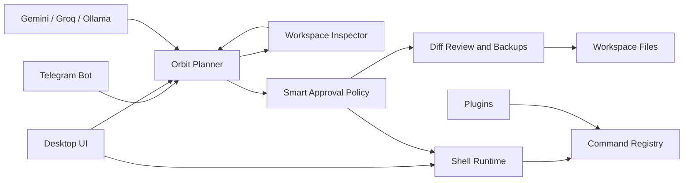

<div align="center">

# RiftShell Orbit

### RiftShell Orbit — Local-first AI Automation Workspace for Windows

**A developer shell that can understand your workspace, run real commands, review code, and stay out of your way.**


*The terminal learned to think. You still hold the keys.*

</div>

---

RiftShell Orbit combines a Windows-first command environment with a professional AI workspace assistant. Use the terminal directly when you know the command, or ask Orbit to inspect a project, explain a file, review code, find bugs, and prepare changes for approval.

It is not trying to hide the shell behind a chatbot. RiftShell keeps commands, output, diffs, approvals, and backups visible—because useful automation should still feel understandable and controllable.

> [!NOTE]
> RiftShell is under active development. The current build is ideal for local experimentation, development workflows, and extending through plugins.

## Why RiftShell Orbit?

| Capability | What it gives you |
|---|---|
| **AI workspace understanding** | Orbit can inspect relevant files and project structure, then explain them in professional English. |
| **Smart execution** | Read-only and low-impact actions flow naturally; destructive or external actions require approval. |
| **Reviewed code changes** | AI-generated edits appear as a unified diff before anything is written. |
| **Atomic reviewed writes** | Approved replacements are staged, backed up under `.ai_backups/`, and rolled back together if any write fails. |
| **Local-first operation** | The shell and execution engine run on your machine, with optional fully local AI through Ollama. |
| **Provider choice** | Use Gemini, Groq, Ollama, or an ordered fallback configuration. |
| **Extensible command system** | Add commands through plugins without rewriting the shell core. |
| **Remote control** | An optional Telegram layer can plan actions, request approval, run commands, and return results. |

## See Orbit think

Ask naturally from the Orbit panel:

```text
Explain the structure of this project.
```

```text
Read README.md and explain what this project does.
```

```text
Review ai/safety.py for bugs, but do not change anything.
```

```text
Review ai/safety.py, fix any real bugs, and show me the proposed changes before applying them.
```

For file understanding, Orbit reads bounded workspace context privately and answers in the chat panel. It does not flood the terminal with raw content. If you explicitly want raw output, use the terminal command:

```text
read README.md
```

## Smart approvals, not constant interruptions

RiftShell uses an impact-aware safety policy. A simple question should feel like a conversation—not a security ceremony.

Runs naturally without approval:

- explanations, planning, and general questions
- file and project inspection
- directory listing, search, navigation, and system information
- calculations and read-only Git operations
- safe version checks such as `run python --version`
- small recoverable local actions such as creating a folder

Requires review or approval:

- deleting files or stopping processes
- moving or renaming existing data
- downloads, archive extraction, and external side effects
- Git commit, pull, push, or checkout operations
- arbitrary native command execution
- opening executable files
- AI-generated file changes

The complete command chain is evaluated, so placing a risky command after a safe command does not bypass approval.

## Workspace-aware code review

Orbit can inspect a specific file or a bounded selection of relevant project files. During inspection, RiftShell skips common sensitive or noisy content, including:

- `.env` and private key files
- Orbit memory files
- binary files
- `.git`, virtual environments, dependency folders, build output, and AI backup folders

Inspected file content is treated as untrusted data, not as instructions. When Orbit proposes a change, the desktop app shows a complete bounded unified diff and waits for one explicit approval. Approval is tied to the exact file state that was reviewed, so an intervening developer edit blocks the write and requires a fresh diff. Approved files are staged before commit, existing files are backed up, and a multi-file failure rolls back changes already applied.

> [!IMPORTANT]
> Smart approvals and workspace restrictions reduce accidental actions, but RiftShell is not a full operating-system sandbox. Review code changes and high-impact commands before approving them.

## Desktop experience

Orbit desktop tasks now follow a bounded plan/action/result loop. After a command
or approved file write, the model receives the actual result and chooses the next
necessary step or explains the outcome. Natural-language conversation uses the
configured model; explicit commands and offline shortcuts remain available.

Each task allows up to eight execution steps and blocks identical repeated
actions. Related-file analysis permits up to three inspection passes. Every new
risky command and every file change still requires its own approval. Tasks stay
attached to their original terminal tab. **Stop task** prevents further steps;
an in-flight provider request or an already approved atomic file write may finish.
Task state is currently in memory and does not resume after restarting the app.
This execution loop is desktop-only; the optional Telegram flow is unchanged.

The PySide6 workspace includes:

- multiple terminal sessions
- command history and fuzzy command search
- tab completion and live suggestions
- command palette and command explorer
- cancellable background command execution
- plugin status and diagnostics
- switchable themes and font preferences
- an integrated Orbit assistant panel
- Markdown responses, diff previews, and execution status

## Quick start

### Requirements

- Windows 10 or Windows 11
- Python 3.10 or newer
- Git, if you want the Git plugin commands
- Ollama, only if you want fully local model inference

### 1. Clone and enter the project

```powershell
git clone https://github.com/sanusharma-ui/riftshell
cd riftshell
```

### 2. Create a virtual environment

```powershell
py -m venv .venv
.\.venv\Scripts\Activate.ps1
```

### 3. Install dependencies

```powershell
py -m pip install -r requirements.txt
py scripts/setup_intent_model.py
```

### 4. Start RiftShell and configure Orbit

```powershell
py main.py
```

Open **Workspace Settings** (`Ctrl+,`) and choose Groq, Gemini, or Local Ollama.
Paste a cloud API key once; RiftShell stores it in Windows Credential Manager,
not in the settings file. For Ollama, start the local service and enter an
installed model name. The provider choice takes effect on the next Orbit task.
The terminal works without a provider.

Developers can still use `.env`: copy `.env.example` to `.env` and edit it.
Desktop settings take precedence once saved; environment keys remain available
when no key is saved in Credential Manager. The optional Telegram bot continues
to use environment configuration.

Orbit needs Gemini, Groq, or Ollama for broader reasoning and workspace analysis.

Orbit combines fast English/Hinglish rules with an offline English semantic
extractor. The setup script downloads a checksum-verified MiniLM model (about
24 MB) once. It compares unfamiliar wording with command capabilities locally;
matched commands avoid cloud planning. Normal conversation and complex tasks
keep Orbit's AI reasoning, and command approvals still apply. See
[command extraction](docs/command-intents.md) for setup, limitations, examples,
plugin extensions, and validation. Without the local model, the original rules
and normal Orbit routing remain available.

## AI provider configuration

### Gemini

```env
AI_PROVIDER=gemini
GEMINI_API_KEY=your_gemini_key
GEMINI_MODEL=gemini-2.5-flash
```

### Groq

```env
AI_PROVIDER=groq
GROQ_API_KEY=your_groq_key
GROQ_MODEL=llama-3.3-70b-versatile
GROQ_TIMEOUT_SECONDS=30
```

### Local Ollama

```env
AI_PROVIDER=ollama
OLLAMA_BASE_URL=http://127.0.0.1:11434
OLLAMA_MODEL=qwen2.5:7b
OLLAMA_TIMEOUT_SECONDS=120
```

Install and start Ollama, then pull the configured model:

```powershell
ollama pull qwen2.5:7b
```

RiftShell talks to Ollama through its local HTTP API, so no additional Python SDK is required.

### Groq-first with Gemini fallback

```env
AI_PROVIDER=auto
AI_PROVIDER_ORDER=groq,gemini
```

In `auto` mode, Orbit tries configured providers in the specified order, skipping providers with a known active quota cooldown. With the configuration above, Groq is preferred; an exception, timeout, invalid response, or empty response falls back to Gemini. Groq SDK retries remain disabled so a failed primary request reaches the fallback promptly. To guarantee that prompts never fall back to another model, select a provider directly instead of using `auto`.

Orbit shares quota cooldowns across turns in the same process, scoped to provider, credential and model. It reads Groq quota headers and provider retry hints. If no provider succeeds, a short rate limit can trigger one generation retry, with at most 15 seconds of total cooldown waiting per task. The desktop shows a cancellable countdown. Confirmed daily exhaustion does not trigger this automatic retry. A generic quota error does not identify whether the limit is daily; unknown retry delays use a 60-second cooldown. Cooldowns are cleared when the app exits and cannot account for other apps using the same organization/project quota.

Provider failure details are kept out of subsequent conversation prompts; the user request and a short failure status remain. Existing saved error records are compacted when constructing prompts without rewriting the history file. Continuation inspections include execution evidence without duplicating the complete base prompt. Command definitions, safety rules, user constraints, inspected source, model choices and output limits are preserved. Completed replies render immediately instead of replaying a typing animation.

For local diagnosis, `ai.provider_runtime.PROVIDER_RUNTIME.diagnostics()` returns the latest 100 timing/status events **inside the running process**. Events include provider calls, quota waits, planning, execution, rendering and input readiness. Provider errors redact configured API keys; prompts, generated answers and command output are not recorded by the diagnostics code. Events also go to the `ai.provider_runtime` Python logger at `DEBUG` level if a developer enables it. These timings are diagnostic evidence, not a guarantee of live provider speed or answer quality.

> [!TIP]
> The shell runtime is always local. Model privacy depends on your selected provider: Gemini and Groq receive prompts through their APIs, while a localhost Ollama configuration keeps model requests on the machine.

## Build the Windows app

Build on Windows with Python installed. Create a clean virtual environment and
install the app and packager:

```powershell
py -m venv .venv
.\.venv\Scripts\python.exe -m pip install -r requirements.txt pyinstaller
```

From the repository root, build the distributable folder:

```powershell
.\.venv\Scripts\python.exe scripts/setup_intent_model.py
.\.venv\Scripts\python.exe -m PyInstaller --noconfirm --clean --onedir --windowed --name RiftShell --collect-submodules keyring.backends --add-data "plugins;plugins" --add-data "assets/intent-model;assets/intent-model" main.py
```

Share the **whole** `dist\RiftShell` folder as a ZIP. The launch file is
`dist\RiftShell\RiftShell.exe`. Do not ship a local `.env` or API keys.
Keep the bundled intent model's `MODEL_CARD.md` and `LICENSE.txt` with its files.
Test the ZIP on another Windows account or PC with no Python installation:
launch, save a Groq key, run an Orbit request, switch to a local Ollama model,
and check terminal commands and bundled plugins. Ollama and its model must be
installed separately by users who choose local inference.

A single-file build is possible by replacing `--onedir` with `--onefile`,
but it extracts to a temporary directory at every launch. After each code
release, build and distribute a new version of the EXE; users' QSettings
preferences and Credential Manager keys remain outside the app folder.

## Workspace and safety configuration

For the desktop app, open **Workspace Settings** (`Ctrl+,`) to choose the Orbit
workspace folder. Leave **Allow Orbit file inspection and writes outside this
folder** off to limit those AI file operations to the chosen folder. Turn it on
when you want Orbit to inspect or propose edits elsewhere. This does not remove
the existing review and approval for file writes or risky commands. Manual
terminal navigation and commands already use their own shell and approval flow.
New settings apply to the next Orbit task; a pending task keeps its original
access boundary.

Source runs and the optional Telegram bot can still use environment variables:

```env
AI_WORKSPACE_ROOT=D:\Projects\riftshell
AI_ALLOW_OUTSIDE_WORKSPACE=false
AI_APPROVAL_TIMEOUT_MINUTES=30
AI_COMMAND_OUTPUT_LIMIT=3500
```

`AI_APPROVAL_TIMEOUT_MINUTES` expires pending **Telegram bot** approvals after
30 minutes by default; desktop Orbit does not use that timer.
`AI_COMMAND_OUTPUT_LIMIT` trims **Telegram bot** messages and review previews
to about 3,500 characters by default; it does not cap the desktop terminal.
Provider request timeouts are separate: Groq defaults to 30 seconds and Ollama
to 120 seconds (`GROQ_TIMEOUT_SECONDS` and `OLLAMA_TIMEOUT_SECONDS`). Advanced
users of a packaged app can set those as Windows environment variables before
launching RiftShell.

## Optional Telegram assistant

Configure the bot and an allowlist:

```env
TELEGRAM_BOT_TOKEN=your_bot_token
TELEGRAM_ALLOWED_USER_IDS=your_numeric_telegram_user_id
TELEGRAM_ALLOW_UNLISTED_USERS=false
```

Start the Telegram layer separately:

```powershell
py run_ai_bot.py
```

Available flows include natural-language requests, direct RiftShell commands, screenshots, pending approvals, and approve/deny controls. Do not enable unlisted users on a machine that contains sensitive data.

## Shell power, when you want it

RiftShell supports commands, aliases, variables, redirection, pipelines, and conditional chaining:

```text
files
where
goto D:\Projects
makefolder demo
calc 5 + 7 * 2
echo hello > note.txt
files | filter py | sort | take 5
setvar PROJECT RiftShell
echo $PROJECT
where ; files
makefolder logs && echo created
read missing.txt || echo fallback
run python --version
```

Useful discovery commands:

```text
help
plugins
history
tree
```

## How it fits together


```mermaid
flowchart LR
    UI[Desktop UI] --> Shell[Shell Runtime]
    Telegram[Telegram Bot] --> Orbit[Orbit Planner]
    UI --> Orbit
    Orbit --> Inspect[Workspace Inspector]
    Orbit --> Safety[Smart Approval Policy]
    Inspect --> Orbit
    Safety --> Shell
    Safety --> Review[Diff Review and Backups]
    Review --> Files[Workspace Files]
    Shell --> Registry[Command Registry]
    Plugins[Plugins] --> Registry
    Providers[Gemini / Groq / Ollama] --> Orbit
```

The shell remains useful on its own. Orbit is an assistant layer over the same command registry, so built-in and plugin commands share one execution model.

## Project structure

```text
RiftShell/
|-- main.py                 # Desktop entry point
|-- run_ai_bot.py           # Optional Telegram entry point
|-- ai/                     # Planning, providers, inspection, safety, file review
|-- commands/               # Built-in RiftShell commands
|-- core/                   # Parser, shell runtime, registry, plugin loader
|-- plugins/                # Git and example plugins
|-- ui/                     # PySide6 workspace and themes
|-- utils/                  # Safe filesystem utilities
|-- tests/                  # Provider, safety, inspection, and editing tests
|-- assets/                 # Application resources
|-- .env.example            # Configuration template
|-- requirements.txt        # Python dependencies
`-- README.md
```

## Build a plugin

Create `plugins/<plugin_name>/plugin.py` and expose a `plugin` object:

```python
from core.base import BaseCommand, CommandResult
from core.plugin_base import BasePlugin


class FocusCommand(BaseCommand):
    name = "focus"
    aliases = ["f"]
    description = "Start a focused work session."
    usage = "focus [minutes]"

    def execute(self, ctx, args):
        minutes = args[0] if args else "25"
        return CommandResult(output=f"Focus session: {minutes} minutes")


class FocusPlugin(BasePlugin):
    name = "focus-tools"
    version = "1.0.0"
    description = "Focused developer workflow commands"

    def register(self, registry):
        registry.register(FocusCommand())


plugin = FocusPlugin()
```

Restart RiftShell after adding or changing a plugin. Run `plugins` to inspect loaded and failed extensions. Registered plugin commands also become available to Orbit through the shared command catalog.

## Development and verification

The Windows desktop runs existing RiftShell commands and persistent PowerShell
commands in one terminal, with automatic routing and shared output. See the
[native terminal guide](docs/native-terminal.md) for dependency setup, Orbit
integration, manual acceptance checks, and current compatibility limits.

Run the test suite:

```powershell
py -m pytest -q
```

Compile-check the Python modules:

```powershell
py -m compileall -q ai core ui commands plugins tests
```

Current coverage includes AI provider selection, response envelopes, smart approvals, chained-command protection, workspace inspection, sensitive-file filtering, complete diff previews, stale-review protection, transactional rollback, file backups, and inspect-to-edit agent behavior.

## Roadmap

- persistent task cards and resumable agent runs
- one-click checkpoint restoration
- reusable parameterized workflows
- WSL, SSH, and Docker execution targets
- capability-based plugin permissions
- packaged Windows installer and update channel
- optional team workflow sharing

## License

PolyForm Noncommercial License 1.0.0 — free for personal, educational, and noncommercial use. Commercial use requires permission. See LICENSE for full terms.

## Author

Created by **Sanu Sharma** — [sanusharma.dev](https://sanusharma.dev)

---

<div align="center">

**Built for Windows. Designed for developers. Ready to automate.**

</div>
